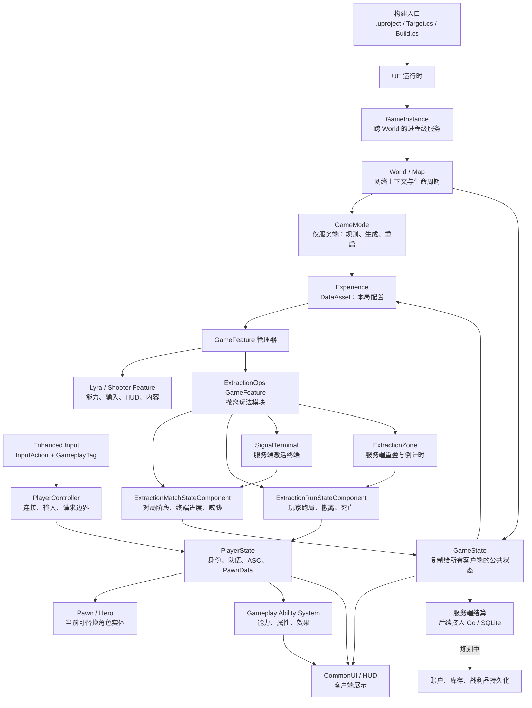

# Extraction Ops 面试版架构说明

> 本文用于面向面试官介绍项目的设计取舍、模块边界和运行时链路。文中明确区分了“当前已验证实现”和“后续规划”，避免把实验能力或待实现能力当成线上能力。

## 1. 30 秒结论

Extraction Ops 是基于 UE 5.8 Lyra Starter Game 和 GameFeature 架构实现的 1～2 人合作 PvE 撤离射击垂直切片。核心目标不是把所有玩法塞进一个 GameMode，而是把“可复用的 Lyra 生命周期”和“撤离玩法的服务端状态机”分开：

- Lyra 负责连接、地图、Experience、Pawn、Ability、输入和 UI 的通用装配。
- `ExtractionOpsRuntime` 负责本项目独有的对局规则：信号终端、威胁等级、撤离区、玩家跑局状态和最终结算条件。
- GameState/PlayerState 承载可复制的权威状态；GameMode 只负责服务端规则和生命周期；客户端 UI 只负责展示。
- 后续再把服务端结算结果通过幂等接口写入 Go 后端和 SQLite，避免让 UE 客户端直接拥有经济系统权威。

一句话可以概括为：**Lyra 负责“怎么组装一场游戏”，ExtractionOps 负责“这场撤离游戏如何推进和结算”。**

## 2. 总体架构



## 3. 先讲清楚三个边界

### 3.1 构建边界：决定目标能否产出

`.uproject` 声明项目、模块和插件；`LyraGame.Target.cs` 区分 Editor、Client、Server；`LyraGame.Build.cs` 声明 C++ 依赖、编译宏和包含路径。它们最终交给 UnrealBuildTool 生成编辑器、客户端或服务端目标。

这个边界存在的原因是：**运行时代码是否正确，和目标是否能被构建出来，是两个问题。** 例如编辑器目标通过，并不能证明 Dedicated Server 能从当前引擎发行版构建出来。

### 3.2 实时对局边界：UE 服务端拥有玩法权威

对局中的终端激活、威胁等级、撤离倒计时、玩家死亡和成功撤离，都必须由服务端判定。客户端只能发起输入或请求，并通过复制状态得到结果。

这样做是为了防止客户端篡改战利品、跳过倒计时或伪造撤离成功，也是多人游戏中“表现”和“权威”分离的基础。

### 3.3 持久化边界：后端拥有账户和经济权威

UE 只负责实时跑局以及生成结算事件；账户、库存、战利品和幂等结算记录由后续 Go 后端和 SQLite 负责。客户端不直接写数据库，UE 服务端也不把数据库表当作实时战斗状态。

这个边界存在是为了隔离高频实时状态和低频持久化状态，并为重连、重复请求、服务重启和审计留下稳定的服务端入口。目前后端持久化属于后续阶段，不应描述为已经完成。

## 4. 模块说明：每个模块为什么存在

### 4.1 构建与项目入口

| 模块 | 主要职责 | 为什么存在 |
|---|---|---|
| `LyraStarterGame.uproject` | 声明 `LyraGame`、`LyraEditor` 及插件 | 提供统一的项目装配入口，让 UE 能发现模块、GameFeature 和编辑器扩展 |
| `LyraGame.Target.cs` | Editor/Client/Server 目标配置 | 把同一套游戏代码编译成不同运行目标，并集中控制测试、Shipping、Dedicated Server 等开关 |
| `LyraGame.Build.cs` | C++ 模块依赖、PCH、编译定义 | 把依赖关系显式化，避免模块通过隐式包含或运行时偶然加载工作 |
| `ExtractionOpsRuntime` | 撤离玩法 C++ 运行时模块 | 将项目规则与 Lyra 基础模块隔离，便于测试、替换和 GameFeature 按需启停 |

### 4.2 UE/Lyra 的运行时生命周期

| 对象 | 作用 | 为什么不能由其他对象替代 |
|---|---|---|
| `GameInstance` | 跨 World 的进程级服务、初始化回调 | 地图切换后仍需保留的服务不能放在 GameState；它不适合保存某一局的对战状态 |
| `World / Map` | 承载当前地图、网络上下文和生命周期 | 玩法对象必须属于某个 World，地图切换和服务器/客户端上下文也在这里确定 |
| `GameMode` | 服务端规则、Experience 选择、Pawn 生成、重启 | 只在服务端存在，适合做权威规则；客户端不能依赖它展示状态 |
| `GameState` | 对所有客户端可见的对局公共状态 | 由服务端创建并复制，是比分、阶段、倒计时和 Experience 状态的共同观察面 |
| `Experience` | `UPrimaryDataAsset`，描述本局使用的 PawnData、Actions 和 GameFeatures | 把“本局配置”从硬编码 GameMode 中抽出，使不同模式可以复用同一套运行时模块 |
| `ExperienceManager` | 加载资产、激活 GameFeature、执行 Action、广播加载完成 | 解决异步加载和模块装配顺序问题；代码应注册 `OnExperienceLoaded`，不能只判断 Experience 已被选中 |

设计要点是：**GameMode 负责决定，GameState 负责公开；Experience 负责配置，Feature 负责注入。**

### 4.3 玩家对象链

```text
连接 / 本地输入
    -> PlayerController
    -> PlayerState（身份、队伍、ASC、PawnData）
    -> Pawn / Hero（当前可替换角色）
    -> UI（读取复制后的状态）
```

| 模块 | 主要职责 | 为什么存在 |
|---|---|---|
| `PlayerController` | 连接级对象、本地输入、向服务端发请求、Possess | 连接和玩家意图不应绑定到可死亡、可重生的 Pawn |
| `PlayerState` | 玩家身份、队伍、PawnData、Ability System Component | 玩家跨 Pawn 生命周期保留的数据应放在这里，尤其是 ASC 不应随 Pawn 死亡而丢失 |
| `Pawn / Hero` | 当前可控制的角色实体、移动和动画表现 | Pawn 是可替换的运行时 Avatar，死亡、重生或换角色时可以重新创建 |
| `PawnExtensionComponent` | 控制 Pawn 从 Spawned 到 GameplayReady 的初始化状态 | 防止输入、能力、动画在依赖尚未准备好时提前执行 |
| `HeroComponent` | 绑定 ASC Avatar、安装本地输入和角色侧能力 | 把角色表现与 PlayerState 中的持久能力系统接起来 |
| CommonUI/HUD | 展示 GameState、PlayerState 和 GameplayMessage | UI 是客户端表现层，不拥有撤离成功、物品数量等权威状态 |

### 4.4 GameFeature：模块化装配层

GameFeature 的核心作用不是“再写一个插件”，而是提供**可加载、可激活、可停用的功能边界**。一个 Experience 可以按场景打开基础玩法、射击玩法或撤离玩法；停用时由 Action 保存的句柄负责撤销注入。

| Feature/Action | 作用 | 为什么存在 |
|---|---|---|
| `GameFeatureData` | 声明该功能启用哪些模块和动作 | 用数据描述功能组合，避免 GameMode 直接依赖所有玩法代码 |
| `AddAbilities` | 向服务器侧 Pawn/ASC 注入能力、属性和 AbilitySet | 让能力随 Feature 生命周期管理，避免重复授予或停用后残留 |
| `AddInputContextMapping` | 给本地玩家加入 Enhanced Input Mapping Context | 输入属于本地玩家，但应随玩法 Feature 开关 |
| `AddInputBinding` | 将 `InputTag` 与 Lyra 输入配置绑定 | 输入动作与具体能力解耦，允许同一能力被不同设备或布局触发 |
| `AddWidgets` | 将 HUD/Widget 推入 CommonUI 层并管理 UIExtension | UI 也必须有生命周期，避免地图切换或 Feature 停用后残留旧界面 |
| `ExtractionOps` | 汇总撤离玩法规则和资源 | 让撤离模式可以独立验证、独立灰度，并能复用 Lyra 的基础链路 |

### 4.5 GameplayAbilities、Enhanced Input 与 CommonUI

- **Gameplay Ability System（GAS）**：统一表达能力、属性、GameplayEffect、GameplayCue 和冷却。服务器负责授予能力及最终效果，Pawn 作为 Avatar，ASC 更适合挂在 PlayerState 上。它存在的原因是让战斗规则可复制、可预测并能复用，而不是把伤害和状态散落在各个 Pawn 蓝图里。
- **Enhanced Input**：通过 `InputAction`、Mapping Context 和 GameplayTag 组织输入。它存在的原因是把“玩家按了什么”和“游戏执行什么能力”分离，支持键鼠、手柄和模式化输入。
- **CommonUI**：管理 UI 层级、输入路由、Widget 生命周期和 UIExtension。它存在的原因是 Lyra 的 HUD 需要按 Experience/Feature 动态组合，且 UI 只能消费复制状态，不能直接改变服务端事实。

### 4.6 ExtractionOps 玩法模块

| 文件/模块 | 责任 | 为什么单独存在 |
|---|---|---|
| `ExtractionMatchStateComponent` | 保存对局阶段、已激活终端数量、威胁等级和奖励倍率 | 这些是全局对局事实，应挂在 GameState 侧并复制给所有客户端 |
| `ExtractionRunStateComponent` | 保存单个玩家当前跑局、撤离中、已撤离或死亡等状态 | 这些是玩家维度事实，应挂在 PlayerState 侧并跨 Pawn 保留 |
| `ExtractionSignalTerminal` | 服务端验证交互、激活终端、推进终端计数和威胁 | 交互物是世界实体，但不能自己决定全局规则；它通过 GameState 组件推进权威状态 |
| `ExtractionZone` | 服务端检测重叠，启动/取消倒计时，确认成功撤离 | 撤离判定必须在服务端完成；离开区域时取消倒计时，避免客户端伪造成功 |
| `ExtractionOpsTypes` | 集中定义阶段、威胁和玩家跑局状态等类型 | 避免状态枚举在组件、Actor 和测试中重复定义，保证规则比较一致 |
| `ExtractionOpsStateRulesTests` | 验证状态转换、威胁和撤离规则 | 将最容易产生边界 bug 的状态机变成自动化验收条件 |
| `B_SignalTerminal` / `B_ExtractionZone` | 关卡可摆放的蓝图资源 | C++ 保证规则和权威性，蓝图负责关卡配置、碰撞和美术表现，形成职责分离 |

这种拆分使面试时可以清楚回答：**世界中的 Actor 负责触发事件，GameState/PlayerState 组件负责保存事实，UI 负责展示事实。**

### 4.7 ShooterCore、ShooterMaps 与测试 Feature

- **ShooterCore** 是可选的通用射击 GameFeature，承载瞄准辅助、收集物、击杀/助攻/连杀消息等公共射击能力。它不是 Lyra 的基础运行时，也不是 ExtractionOps 的专属规则，因此通过 Feature 边界隔离。
- **ShooterMaps** 提供地图和内容资源，不需要额外的 C++ 运行时模块。地图通过 Experience/Feature 被选择，避免把所有地图内容默认加载进每个目标。
- **ShooterTests** 只在开发/编辑器测试目标中启用，覆盖输入、动画、网络和能力相关验证。测试代码不应进入 Shipping，以减少包体和运行时风险。

### 4.8 网络、在线服务与复制优化

| 模块 | 设计位置 | 为什么存在/当前边界 |
|---|---|---|
| 普通 Replication | 当前默认路径 | 先保证权威状态正确，再做复制频率和相关性优化；当前配置关闭了 ReplicationGraph 默认路径 |
| ReplicationGraph | 可选优化层 | 当实体数量和观测关系变复杂时，按连接裁剪复制范围；它优化“发给谁、多久发一次”，不改变玩法权威 |
| OnlineServices | 登录、Session、Lobby 抽象 | 将 Steam/EOS/本地 Null 实现隔离；启用相关插件不等于线上 Steam/EOS 链路已经完成 |
| Session/Travel | 组队、进入地图、切换 Experience | 负责把大厅玩家送入正确的对局 World；玩法状态仍由 GameMode/GameState 决定 |

面试中的准确说法是：项目当前以本地 IP/Null 路径作为基线，Steam/EOS 配置和 Dedicated Server 属于后续联机验证范围。

## 5. 三条关键运行时链路

### 5.1 启动与功能装配

```text
GameInstance 初始化
    -> World / GameMode 创建
    -> GameMode 选择 Experience
    -> GameState 的 ExperienceManager 异步加载
    -> 激活 GameFeature 并执行 Actions
    -> 注入能力、输入、HUD 和撤离组件
    -> 广播 ExperienceLoaded
    -> 玩家 Pawn 进入 GameplayReady
```

这里异步加载和 `ExperienceLoaded` 回调很重要：资产选择完成不代表依赖已经可用，Pawn、输入和 HUD 必须等待依赖链就绪。

### 5.2 输入到能力

```text
Enhanced Input
    -> InputAction
    -> InputTag
    -> Hero / ASC 查找能力
    -> 客户端请求，服务端验证并激活 Ability
    -> GameplayEffect / GameplayCue
    -> 属性和状态复制
    -> CommonUI 展示
```

输入只表达意图，服务端才决定最终效果；客户端可以预测表现，但不能成为最终结算来源。

### 5.3 终端到撤离结算

```text
玩家服务端交互终端
    -> MatchState 增加终端进度
    -> 威胁等级和奖励倍率更新
    -> 撤离区检测玩家进入
    -> GameState 服务端时钟倒计时
    -> 离开则取消，完成则 RunState=Extracted
    -> 服务端生成结算事件
    -> 后续由 Go 后端幂等落库
```

终端和撤离区都不能直接修改客户端 UI 或数据库；它们只推进权威状态，UI 观察复制结果，持久化层接收最终结算。

## 6. 权威性与数据归属

| 数据 | 权威位置 | 客户端能做什么 |
|---|---|---|
| 对局阶段、终端进度、威胁等级 | `GameState` 上的 MatchState 组件 | 读取并展示 |
| 玩家跑局状态、撤离/死亡结果 | `PlayerState` 上的 RunState 组件 | 读取并展示 |
| 当前角色位置、动画和临时表现 | Pawn | 输入意图、表现预测 |
| 能力、属性、效果 | 服务端 ASC/GAS | 发起请求，不能决定最终效果 |
| 账户、库存、战利品持久化 | 后续 Go 后端/SQLite | 通过受控 API 访问 |
| 临时提示、击杀消息 | GameplayMessage / RPC / Multicast | 消费瞬时事件；不能作为持久事实唯一来源 |

核心原则是：**持久事实走复制状态，瞬时体验走消息；任何需要重连后恢复的信息，都必须有可重新读取的权威状态。**

## 7. 面试时的五分钟讲法

1. **先说目标**：这是一个 1～2 人合作 PvE 撤离射击垂直切片，重点是“进入跑局、获得战利品、完成撤离或死亡、服务端结算”。
2. **再说分层**：UE/Lyra 负责通用生命周期和功能装配，ExtractionOps 负责撤离规则，后端负责持久化。
3. **说明状态归属**：全局状态在 GameState，玩家状态在 PlayerState，当前角色在 Pawn；GameMode 只存在于服务端并负责规则。
4. **解释 GameFeature**：Experience 选择要启用的功能，GameFeature Actions 注入能力、输入和 HUD；这样同一套基础代码可以组合出不同模式。
5. **讲一个闭环**：终端由服务端验证并推进 MatchState，撤离区由服务端倒计时并推进 RunState，最后生成结算事件。
6. **主动讲边界**：编辑器构建、规则测试和 PIE 组件注入已经验证；当前 Installed Build 不支持 Server target，因此 Dedicated Server 和双客户端连接还需要切换 Source Engine 后完成。

## 8. 面试高频追问与回答方向

### 为什么不把所有逻辑都放在 GameMode？

GameMode 只在服务端存在，且更适合规则和生命周期。如果客户端需要看到某个状态，就必须放到 GameState/PlayerState 并复制；如果逻辑要随模式启停，就应放进 GameFeature，而不是让 GameMode 永久依赖全部玩法。

### 为什么把状态放在组件而不是直接堆在 GameState？

组件让状态按领域拆分，并保留清晰的复制和测试边界。MatchState 是全局对局域，RunState 是玩家跑局域，未来增加任务或经济状态时不会继续膨胀一个巨型 GameState。

### 客户端能否直接请求“我已撤离”？

不能。客户端只能报告输入或进入区域的意图，服务端根据碰撞、距离、倒计时、当前阶段和玩家状态重新验证，成功后才写入 RunState 并产生结算。

### 为什么需要 Experience 和 GameFeature 两层？

Experience 描述“这一局选择什么配置”，GameFeature 描述“功能如何被动态注入和撤销”。前者是模式组合，后者是模块生命周期；把两者混在 GameMode 中会导致模式之间强耦合。

### 为什么不现在就上 ReplicationGraph？

当前垂直切片首先要证明状态正确性和玩法闭环。ReplicationGraph 解决的是大规模实体的复制路由和频率问题，应该在有 profiling 证据时引入，而不是提前增加网络调试复杂度。

## 9. 当前实现状态与诚实边界

当前已验证：

- `ExtractionOps` GameFeature Runtime 模块已启用。
- GameFeatureData 可向 `LyraGameState` 注入 MatchState，向 `LyraPlayerState` 注入 RunState。
- 终端服务端激活、唯一终端计数、三档威胁等级和奖励倍率已实现。
- 撤离区服务端重叠、GameState 服务端倒计时、离开取消和成功撤离已实现。
- `B_SignalTerminal`、`B_ExtractionZone` 蓝图资源已提供。
- `LyraEditor Win64 Development` 构建通过；状态规则自动化测试通过；PIE 已验证 GameFeature 组件注入。

当前未完成或待验证：

- 当前 `D:\Software\UE_5.8` 是 Installed Build，构建 `LyraServer Win64 Development` 会因该引擎发行版不支持 Server target 而失败；需要 Source Engine 基线后继续 Dedicated Server 和双客户端连接验证。
- Steam/EOS 真实线上登录、Session/Lobby、ReplicationGraph 大规模优化尚未作为当前完成项声明。
- Go 后端、SQLite 账户/库存/结算持久化属于下一阶段；当前文档只描述其边界和接入位置。

## 10. 代码和资料索引

- [项目总览](../README.md)
- [实现状态与硬门槛](../implementation-status.md)
- [Lyra 四条运行时链路](lyra-four-chain-research.md)
- [Lyra 能力与插件边界](lyra-enabled-capabilities-research.md)
- [构建入口文件说明](lyra-build-entry-files.md)
- [UE5 Source Build Windows 方案](ue5-source-build-windows.md)
- [ExtractionOps Runtime 模块](../../Plugins/GameFeatures/ExtractionOps/Source/ExtractionOpsRuntime/)
- [ExtractionOps GameFeature 描述](../../Plugins/GameFeatures/ExtractionOps/ExtractionOps.uplugin)

