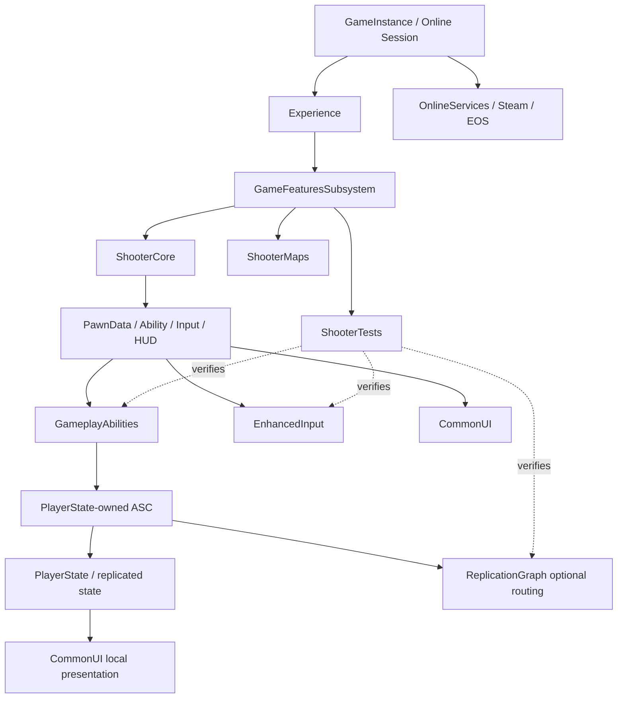

# Lyra 已启用能力研究记录

> 研究日期：2026-08-09  
> 研究对象：`LyraStarterGame` 及其 `GameFeatures` 插件  
> 研究范围：`GameplayAbilities`、`ReplicationGraph`、`CommonUI`、`EnhancedInput`、`GameFeatures`、`OnlineServices`、`ShooterCore`、`ShooterMaps`、`ShooterTests`

## 结论先行

这 9 项能力处在不同的架构层级，不能简单地理解为“9 个同类插件”：

| 能力 | 主要职责 | 当前项目状态 | 关键边界 |
|---|---|---|---|
| GameplayAbilities | 能力、属性、GameplayEffect、GameplayCue | 已启用并被 Lyra 核心代码大量使用 | 服务器授予和验证能力；Pawn 通常只是 Avatar |
| ReplicationGraph | 大规模网络复制的路由和频率控制 | 模块启用，但默认被配置关闭 | 先保证普通复制正确，再单独验证 Graph 优化 |
| CommonUI | 分层 UI、输入路由、Widget 生命周期 | 已启用，通过 HUD 和 GameFeature 注入 UI | 主要是本地玩家 UI，不是权威游戏状态 |
| EnhancedInput | Input Mapping Context 和 Input Action | 已启用，是 Lyra 输入主路径 | 键鼠/手柄输入发生在本地客户端 |
| GameFeatures | 可加载、可激活、可撤销的模块化功能 | 已启用，是项目组合层 | Experience 决定何时加载和激活具体功能 |
| OnlineServices | 登录、会话、大厅、在线服务抽象 | 未直接列在 `.uproject`，由目标配置和适配器接入 | 是否使用 Steam/EOS 取决于 Target 和 CustomConfig |
| ShooterCore | 射击游戏的通用玩法能力 | Game Feature，默认不自动激活 | 提供射击模板能力，不应当当作 Lyra 基础层 |
| ShooterMaps | 射击地图和相关内容 | Game Feature，默认不自动激活 | 主要提供地图/内容资产，不提供独立 C++ Runtime 模块 |
| ShooterTests | 射击玩法、输入、动画、复制的自动化测试 | Game Feature，Shipping 被禁止 | 只用于 Editor/开发测试，不是运行时游戏功能 |

最重要的两个现状结论：

1. `ReplicationGraph` 虽然启用了插件，但项目配置中的 `bDisableReplicationGraph=True`，所以当前默认运行路径仍然不是 Replication Graph。
2. `OnlineServices` 没有作为直接插件项出现在项目文件中；项目通过 `OnlineServicesNull`、`OnlineServicesOSSAdapter`、Steam/EOS 目标配置和自定义 Engine 配置选择具体在线服务。

## 一、整体分层



这里的核心关系是：`Experience` 负责组合功能，`GameFeature` 负责注入组件/输入/UI/能力，`GameplayAbilities` 和 `EnhancedInput` 负责玩法执行，`CommonUI` 负责本地呈现，`OnlineServices` 负责在线会话和平台能力，`ShooterTests` 负责验证这些链条。

## 二、项目启用矩阵和证据

项目直接启用项可以在 [`LyraStarterGame.uproject`](../../LyraStarterGame.uproject) 中看到：

- `GameplayAbilities`
- `ReplicationGraph`
- `CommonUI`
- `EnhancedInput`
- `GameFeatures`
- `ShooterCore`
- `ShooterMaps`
- `ShooterTests`

`OnlineServices` 没有直接出现在该文件中，但下列在线服务相关插件已启用：

- `OnlineFramework`
- `OnlineServicesNull`
- `OnlineServicesOSSAdapter`
- `OnlineSubsystemSteam`
- `SocketSubsystemSteamIP`
- `SteamSockets`

这意味着“项目具备 OnlineServices 接入能力”是准确的；“当前默认一定连接 Steam/EOS”则不准确，具体服务由 Target 和 CustomConfig 决定。

## 三、GameplayAbilities

### 3.1 职责

`GameplayAbilities`（通常简称 GAS）提供统一的：

- Gameplay Ability：主动技能、被动技能、输入触发技能。
- Attribute Set：生命、护甲、伤害等可复制属性。
- Gameplay Effect：修改属性、施加状态、授予标签、提供免疫。
- Gameplay Tag：能力、状态和输入之间的解耦标识。
- Gameplay Cue：受 Gameplay Effect 或标签驱动的表现反馈。

它解决的是“玩法效果如何定义、授予、预测、复制和撤销”，不是单纯的输入系统，也不是 UI 系统。

### 3.2 当前项目接入方式

Lyra 的能力系统以 `PlayerState` 为持久宿主，以 Pawn 作为当前 Avatar：

1. [`ALyraPlayerState`](../../Source/LyraGame/Player/LyraPlayerState.cpp) 构造并复制 `ULyraAbilitySystemComponent`、`ULyraHealthSet` 和 `ULyraCombatSet`。
2. PlayerState 初始化 Ability Actor Info，之后在 Experience 加载完成时根据 `PawnData` 授予能力集。
3. [`ULyraAbilitySet`](../../Source/LyraGame/AbilitySystem/LyraAbilitySet.h) 将 Gameplay Ability、Gameplay Effect、AttributeSet 和输入标签打包成可复用数据资产。
4. [`ULyraAbilitySet::GiveToAbilitySystem`](../../Source/LyraGame/AbilitySystem/LyraAbilitySet.cpp) 只允许权威端授予能力，并把 AbilitySet 中的 `InputTag` 写入 AbilitySpec 的动态标签。
5. [`ULyraHeroComponent`](../../Source/LyraGame/Character/LyraHeroComponent.cpp) 在 Pawn 准备好后，把 Pawn 连接到 PlayerState 的 ASC，形成“ASC 在 PlayerState、Avatar 在 Pawn”的关系。
6. [`GameFeatureAction_AddAbilities`](../../Source/LyraGame/GameFeatures/GameFeatureAction_AddAbilities.cpp) 可以在某个 Game Feature 激活时向符合条件的 Actor 注入能力、属性集和能力集，并在停用时按句柄撤销。

### 3.3 运行端边界

- 能力、属性和 GameplayEffect 的授予/移除必须由服务器控制。
- 客户端可以进行本地输入和预测，但不能因为客户端输入就直接相信最终伤害、生命或权限结果。
- ASC 放在 PlayerState 上，使角色换 Pawn、重生或重新附身时，玩家持久状态不必随 Pawn 一起丢失。
- Ability 的输入不是硬编码按键，而是通过 `GameplayTag` 与 Enhanced Input 配对。

### 3.4 对本项目的使用建议

新增技能时优先采用“Ability 类 + AbilitySet + GameplayTag + GameplayEffect”的组合。不要在 Pawn 里直接堆叠伤害、冷却和状态变量；这些应当放入能力系统或 AttributeSet。若功能是可选玩法，优先通过 `GameFeatureAction_AddAbilities` 注入。

## 四、ReplicationGraph

### 4.1 职责

Replication Graph 是服务器侧的网络复制路由层。它根据 Actor 类型、空间位置、连接关系和重要性，决定：

- 哪些 Actor 进入哪些连接的复制列表。
- 哪些 Actor 应该始终相关（Always Relevant）。
- 哪些 Actor 采用空间网格或距离相关的复制。
- PlayerState 等高频 Actor 如何限制每帧处理量。
- Tear-off Actor 等特殊对象如何单独处理。

它优化的是“复制候选对象如何被组织和分发”，不会自动修复错误的 RPC、错误的权限判断或错误的 Replicated 属性设计。

### 4.2 当前项目实现

项目配置 [`DefaultGame.ini`](../../Config/DefaultGame.ini) 中设置了：

```ini
[/Script/LyraGame.LyraReplicationGraphSettings]
bDisableReplicationGraph=True
DefaultReplicationGraphClass=/Script/LyraGame.LyraReplicationGraph
```

因此当前默认状态是：插件和类已准备好，但 Replication Graph 默认关闭。

实现入口为 [`ULyraReplicationGraph`](../../Source/LyraGame/System/LyraReplicationGraph.h) / [`LyraReplicationGraph.cpp`](../../Source/LyraGame/System/LyraReplicationGraph.cpp)，主要包含：

- `GridSpatialization2D`：按二维空间网格组织 Actor。
- `AlwaysRelevant`：处理始终相关对象。
- 每连接的 Always Relevant 节点：处理连接特有对象。
- PlayerState 频率限制节点：避免 PlayerState 在单帧过度消耗复制预算。
- Tear-off 节点：处理生命周期即将结束的复制对象。
- Actor 分类与路由：根据复制策略把 Actor 加入对应节点。

### 4.3 运行端边界

- Graph 主要运行在服务器的复制驱动路径上。
- 它不替代普通 `UPROPERTY(Replicated)`、RPC、`GetLifetimeReplicatedProps` 等基础网络机制。
- 空间化策略必须和 Actor 的 relevancy、移动方式、网络频率配合，否则可能造成客户端看不到对象或收到过时状态。
- 调优前必须保留“Graph 关闭”的基线，否则很难判断问题来自玩法代码还是复制路由。

### 4.4 对本项目的结论

Week 02 不应直接把 `bDisableReplicationGraph` 改成 `False` 当作“开启能力”就结束。正确顺序是：

1. 先用当前普通复制路径验证服务器、客户端、Pawn、PlayerState 和 GameState 的正确性。
2. 使用同一地图和同一客户端数量记录基础复制行为。
3. 开启 Graph 后重新验证相关性、重生、PlayerState、投射物、拾取物和地图边界。
4. 使用源码中的调试命令检查路由，例如 `Net.RepGraph.PrintAllActorInfo` 和 `Lyra.RepGraph.PrintRouting`。

## 五、CommonUI

### 5.1 职责

CommonUI 是面向多平台的 UI 基础设施，重点解决：

- UI Layer 分层和内容栈。
- Widget 的激活、停用和输入焦点。
- 键鼠、手柄、触屏等输入提示与 UI 导航。
- 面向 LocalPlayer 的 UI 生命周期。
- 在菜单、弹窗、HUD、暂停界面之间协调输入优先级。

它不是游戏状态存储系统。UI 应当观察 PlayerState、GameState、消息路由或本地会话状态，再把状态表现出来。

### 5.2 当前项目接入方式

- [`LyraHUD`](../../Source/LyraGame/UI/LyraHUD.h) 主要作为 HUD 扩展接收器；Lyra 的建议是用 Experience 中的 Add Widget Action 添加布局和 Widget，而不是修改 HUD 类本身。
- [`GameFeatureAction_AddWidget`](../../Source/LyraGame/GameFeatures/GameFeatureAction_AddWidget.cpp) 在 HUD 就绪后，通过 `UCommonUIExtensions::PushContentToLayer_ForPlayer` 把 UI 布局推入指定 Layer。
- [`CommonUIExtensions`](../../Plugins/CommonGame/Source/Public/CommonUIExtensions.h) 提供向指定玩家推送/弹出 UI 内容以及输入挂起、恢复等操作。
- `DefaultGame.ini` 配置了 CommonUI 的 Rich Text 数据类；`DefaultInput.ini` 开启了 Enhanced Input 兼容。

### 5.3 运行端边界

- CommonUI 的 Widget 和输入焦点是本地玩家侧概念。
- UI 不应直接决定服务器权威状态；按钮点击应发起请求或调用可验证的玩法入口。
- 多人游戏中每个 LocalPlayer 都应有自己的 UI Layer 和输入上下文。
- Game Feature 停用时，必须移除通过 UI Extension 注册的句柄，否则容易留下重复 Widget 或失效引用。

### 5.4 对本项目的使用建议

新增 HUD、菜单或弹窗时，优先设计为 CommonUI Widget，并通过 Experience/GameFeature 的 Add Widget Action 注入 Layer。需要显示的游戏事实从 PlayerState/GameState 或消息系统读取；不要在 Widget 内部复制一份会变化的权威数据。

## 六、EnhancedInput

### 6.1 职责

Enhanced Input 把“设备输入”和“玩法动作”拆成两层：

1. `Input Mapping Context`：把键盘、鼠标、手柄等设备输入映射到 `InputAction`。
2. `InputAction`：表达 Move、Look、Jump、Crouch、Fire 等语义动作，并提供修饰器、触发器和输入值类型。

这样可以在不改玩法代码的前提下替换键位、设备或上下文。

### 6.2 当前项目接入方式

- [`ULyraInputConfig`](../../Source/LyraGame/Input/LyraInputConfig.h) 维护 Native Input Actions 和 Ability Input Actions。
- Native Action 由代码绑定，例如 Move、Look、Crouch、AutoRun。
- Ability Action 通过 `InputAction -> GameplayTag` 关联到 GAS AbilitySpec 的输入标签。
- [`ULyraHeroComponent`](../../Source/LyraGame/Character/LyraHeroComponent.cpp) 在本地玩家 Pawn 初始化时加载 Mapping Context，向 Enhanced Input LocalPlayer Subsystem 注册映射，并完成 Native/Ability Action 绑定。
- [`GameFeatureAction_AddInputContextMapping`](../../Source/LyraGame/GameFeatures/GameFeatureAction_AddInputContextMapping.cpp) 在 Game Feature 激活时向本地玩家添加 Mapping Context，在停用时移除。
- [`GameFeatureAction_AddInputBinding`](../../Source/LyraGame/GameFeatures/GameFeatureAction_AddInputBinding.cpp) 在 Hero 就绪时添加额外的输入配置。

### 6.3 运行端边界

- 读取键盘、鼠标、手柄和触屏输入只发生在本地客户端。
- 服务器不应依赖客户端的 Mapping Context 来判断权限；服务器只验证 RPC、Ability 激活条件和最终玩法结果。
- Mapping Context 的优先级和停用逻辑必须成对管理，否则容易出现菜单打开后角色仍能移动、或 Feature 卸载后输入残留。
- 同一个 InputTag 可以连接多个能力，但应明确冲突策略和优先级。

### 6.4 对本项目的使用建议

新增动作按以下路径接入：

```text
按键/设备
  -> Input Mapping Context
  -> InputAction
  -> LyraInputConfig
  -> Native 回调 或 GameplayTag
  -> Ability / Pawn 行为
```

不要在角色类里直接读取硬编码键位；把可配置的动作放到 Input Action 和 Input Config 资产中。

## 七、GameFeatures

### 7.1 职责

GameFeatures 是项目的模块化组合机制。一个 Game Feature 可以携带：

- 内容资产。
- C++ Runtime 模块。
- GameFeatureData。
- Add Components、Add Abilities、Add Widgets、Add Input 等 Action。
- 激活时的注册逻辑和停用时的撤销逻辑。

它的价值在于：功能可以按 Experience、平台、模式或测试环境进行加载和激活，而不必把所有逻辑永久写进 LyraGame。

### 7.2 当前项目生命周期

项目在 [`DefaultGame.ini`](../../Config/DefaultGame.ini) 中使用 `LyraGameFeaturePolicy` 作为 Game Features 管理策略。策略类：

- 初始化 Game Features 管理器。
- 注册 Hotfix 和 GameplayCue 路径观察者。
- 根据是否是 Dedicated Server 或 Client-only 决定加载客户端数据、服务器数据。
- 在 Feature 注册、加载、激活和停用时协调资产路径与 Action。

目标配置 [`Source/LyraGame.Target.cs`](../../Source/LyraGame.Target.cs) 还会配置 Game Feature 插件根目录、检查内置 Feature 的初始状态，并根据目标类型处理加载选项。

典型生命周期可以概括为：

```text
Registered
  -> Loaded
  -> Active
  -> Deactivating
  -> Registered / Unregistered
```

`Experience` 中的 `GameFeaturesToEnable` 和 Action Sets 是实际组合入口。Experience Manager 负责等待 Feature 加载完成，再执行其 Actions；切换 Experience 时再执行停用路径。

### 7.3 当前 Feature 的共同特征

[`ShooterCore.uplugin`](../../Plugins/GameFeatures/ShooterCore/ShooterCore.uplugin)、[`ShooterMaps.uplugin`](../../Plugins/GameFeatures/ShooterMaps/ShooterMaps.uplugin) 和 [`ShooterTests.uplugin`](../../Plugins/GameFeatures/ShooterTests/ShooterTests.uplugin) 都具有以下特征：

- `Type: GameFeature`
- `CanContainContent: true`
- `ExplicitlyLoaded: true`
- `EnabledByDefault: false`
- `BuiltInInitialFeatureState: Registered`

也就是说，项目文件中的“已启用”表示这些插件可用并参与构建/发现，不等于它们在每张地图、每个 Experience 中都处于 Active。

### 7.4 运行端边界

- Feature Action 必须同时实现激活和停用，尤其是输入映射、UI 扩展、能力句柄和组件扩展。
- Dedicated Server 与 Client-only 的数据加载不同，不能假设一份 Feature 内容在所有运行端都按同样方式加载。
- Experience 是组合层；普通游戏规则应放在对应模块或 Feature 内，而不是让 GameInstance 直接知道所有 Feature 的内部类。

### 7.5 对本项目的使用建议

Week 02 新增玩法时，优先问三个问题：

1. 这是所有模式都需要的基础能力，还是一个可选 Feature？
2. 激活时要注入哪些组件、能力、输入和 UI？停用时如何撤销？
3. Dedicated Server、Listen Server、Client-only 是否需要不同的数据和 Action？

如果答案是“可选玩法”，用新的 GameFeature 或现有 ShooterCore 的 Action 扩展，避免把模式特有逻辑硬编码进 LyraGame 核心。

## 八、OnlineServices

### 8.1 职责

OnlineServices 是在线服务抽象层，通常承载：

- 用户登录和身份。
- Session/Session Search。
- Lobby 和成员状态。
- Presence、好友、邀请等平台能力。
- Voice Chat 或平台网络能力的适配。

它和 Unreal 的网络复制不是同一件事：ReplicationGraph 负责 Actor 状态复制；OnlineServices 负责“玩家如何登录、发现和加入一场在线游戏”。

### 8.2 当前项目接入方式

项目的在线配置分为多套：

- [`Config/Custom/Steam/DefaultEngine.ini`](../../Config/Custom/Steam/DefaultEngine.ini)：默认平台服务为 Steam，使用 Steam Sockets 和 Steam Online Services。
- [`Config/Custom/EOS/DefaultEngine.ini`](../../Config/Custom/EOS/DefaultEngine.ini)：使用 EOS，配置 EOS NetDriver 和 EOS Online Services。
- [`Config/Custom/SteamEOS/DefaultEngine.ini`](../../Config/Custom/SteamEOS/DefaultEngine.ini)：组合 Native Steam 与 EOS 服务。
- `DefaultEngine.ini` 中的 `[OnlineServices]` 和 `[OnlineServices.Lobbies]` 提供默认在线服务与 Lobby 行为设置。
- [`LyraGameEOS.Target.cs`](../../Source/LyraGameEOS.Target.cs) 和 [`LyraServerEOS.Target.cs`](../../Source/LyraServerEOS.Target.cs) 使用 `CustomConfig="EOS"` 并启用 EOS 相关插件。
- Steam/EOS 目标文件分别选择 Steam、EOS 或混合模式对应的 NetDriver。

当前 Week 01 的本地启动脚本使用本地 IP NetDriver 和 `127.0.0.1:7777`，这证明的是本地 Server/Client 连接链路，不足以证明 Steam Lobby、EOS 登录或生产在线服务已经打通。

### 8.3 运行端边界

- OnlineServices 的具体实现由平台、Target、配置和运行环境共同决定。
- `OnlineServicesNull` 适合本地或无平台服务的测试，但不等价于 Steam/EOS 的真实行为。
- Session/Lobby 的发现和加入与地图加载、Experience 加载、网络连接是多个阶段，不能把“创建 Session 成功”当成“玩家已进入正确 Experience”。
- 生产环境还需要明确登录凭证、平台 AppId、服务器部署方式、权限、超时和失败恢复。

### 8.4 对本项目的结论

当前项目已经具备在线服务切换骨架，但应把它理解为“多目标配置下的接入层”，而不是已经完成的在线后端。Week 02 若继续做本地联机，应继续使用 Null/IP 路径建立可重复基线；只有在明确目标平台后，才验证 Steam/EOS 的登录、Lobby、邀请、加入和断线恢复。

## 九、ShooterCore

### 9.1 定位

ShooterCore 是 Lyra 上层的射击游戏通用 Feature，不是 Unreal 的通用底层模块，也不是所有模式都必须永久激活的核心模块。

[`ShooterCore.uplugin`](../../Plugins/GameFeatures/ShooterCore/ShooterCore.uplugin) 的关键属性为：

- Game Feature，可携带内容。
- Explicitly Loaded，默认不启用。
- Runtime 模块为 `ShooterCoreRuntime`。
- 依赖 GameplayAbilities、CommonUI、EnhancedInput、CommonGame、GameplayMessageRouter 等。

### 9.2 提供的能力类型

从 `ShooterCoreRuntime` 的模块和源码可以看到，它主要聚合：

- Aim Assist 目标管理、目标组件和输入修饰器。
- 世界收集物、拾取物和相关交互。
- 击杀、助攻、连杀、荣誉/Accolade 等消息处理器。
- 控制点、团队死斗等射击模式支撑逻辑。
- 依赖 Lyra 的 Ability、Input、UI 和消息系统，把射击玩法接到通用框架上。

模块入口和依赖见 [`ShooterCoreRuntime.Build.cs`](../../Plugins/GameFeatures/ShooterCore/Source/ShooterCoreRuntime/ShooterCoreRuntime.Build.cs)。

### 9.3 运行端边界

- ShooterCore 的内容和 Action 只有在对应 Experience 激活它时才应当生效。
- Aim Assist 的输入修饰和目标选择主要发生在本地控制端，但命中、伤害和计分必须走服务器权威玩法。
- 收集物、击杀消息和模式规则应区分“本地表现”和“复制状态”。
- 如果项目做非射击模式，不要为了复用某个小类而整体激活 ShooterCore；应评估抽取公共能力或创建更小的 Feature。

## 十、ShooterMaps

### 10.1 定位

ShooterMaps 是内容型 Game Feature，主要提供射击样例地图及配套资产，不包含独立的 Runtime C++ 模块。

[`ShooterMaps.uplugin`](../../Plugins/GameFeatures/ShooterMaps/ShooterMaps.uplugin) 表明它：

- 可包含内容。
- Explicitly Loaded。
- 默认不启用，初始状态为 Registered。
- 依赖 ShooterCore 和 LyraExampleContent。

Week 01 使用的本地地图路径为 `/ShooterMaps/Maps/L_Convolution_Blockout`，说明当前本地联机验收依赖 ShooterMaps 提供的地图资产。

### 10.2 运行端边界

- 地图是否可被加载，取决于插件内容是否已发现/加载以及目标包是否包含对应资产。
- 地图资产本身不等于游戏模式；地图还需要 World Settings、GameMode、Default Gameplay Experience 和相关 Feature 配置配合。
- 服务器和客户端必须使用一致且可访问的地图包，否则会出现连接后地图加载失败或版本不一致。

### 10.3 对本项目的使用建议

新增测试地图或射击场景时，优先放在适当的内容 Feature 中，并通过 Experience 引用玩法组合。脚本中可以使用稳定的长包名，但应在打包、Dedicated Server 和客户端之间验证资产可见性。

## 十一、ShooterTests

### 11.1 定位

ShooterTests 是随 Lyra 提供的射击玩法测试 Feature，目标是验证“输入触发行为、动画反馈、Gameplay Ability、网络复制和蓝图功能测试”是否符合预期。

[`ShooterTests.uplugin`](../../Plugins/GameFeatures/ShooterTests/ShooterTests.uplugin) 的重要配置是：

- Runtime 模块为 `ShooterTestsRuntime`。
- 依赖 GameplayAbilities、EnhancedInput、CQTest、CQTestEnhancedInput 等。
- `TargetConfigurationDenyList` 包含 `Shipping`。

因此它是 Editor/开发测试能力，不应被当作 Shipping 游戏运行时依赖。

### 11.2 当前覆盖范围

插件自带 [`README.md`](../../Plugins/GameFeatures/ShooterTests/README.md)，并实现了几类测试：

- CQTest Actor Animation：输入后是否播放预期动画。
- CQTest Actor Replication：在 Server/Client PIE 会话中验证输入、动画和复制结果。
- GameplayAbility Map Test：加载 `L_ShooterTest_Basic`，验证 GameplayEffect 伤害和治疗是否正确影响 HealthSet。
- Blueprint Functional Test：例如 AutoRun 和开火后弹药变化。

源码证据：

- [`ShooterTestsMapTests.cpp`](../../Plugins/GameFeatures/ShooterTests/Source/ShooterTestsRuntime/Private/ShooterTestsMapTests.cpp) 中的 `AbilitySpawnerMapTest` 验证 GameplayEffect 造成伤害、治疗恢复和 ASC/HealthSet 状态。
- [`ShooterTestsActorNetworkTests.cpp`](../../Plugins/GameFeatures/ShooterTests/Source/ShooterTestsRuntime/Private/ShooterTestsActorNetworkTests.cpp) 中的 `InputAnimationTest` 建立网络测试并分别在服务器、客户端检查动画/输入结果。
- [`ShooterTestsRuntime.Build.cs`](../../Plugins/GameFeatures/ShooterTests/Source/ShooterTestsRuntime/ShooterTestsRuntime.Build.cs) 显示它直接依赖 LyraGame、GameplayAbilities、EnhancedInput 和 CQTest。

### 11.3 运行端边界

- 普通 Functional Test 可在 Editor/Automation 环境运行。
- 网络测试需要 Server/Client PIE 会话，不能用单机 PIE 结果替代。
- 测试地图需要正确加载 Experience、组件、输入和角色资产。
- 动画测试对角色模型和动画层敏感；随机选择 Manny/Quinn 会造成测试不稳定，测试环境应固定角色或接受明确的角色矩阵。
- 当前工作区 Week 01 的自动化日志中曾出现 `LogAutomationTest: Condition failed` 和引擎工具链 Python 错误；这些只能作为当前验收环境的已知信号，不能据此宣称 ShooterTests 全部通过。

### 11.4 对本项目的使用建议

Week 02 可以把 ShooterTests 当作验收模板，而不是只运行现成测试：

1. 为本地 Server/Client 启动链路添加可重复的连接测试。
2. 为一个 AbilitySet 增加“授予、输入触发、GameplayEffect、复制结果”的测试。
3. 为一个 CommonUI Widget 增加打开、关闭、Feature 停用后不残留的测试。
4. 为 GameFeature 增加激活/停用对输入映射、能力句柄和 UI Extension 的对称性检查。
5. 对 ReplicationGraph 保留关闭和开启两组结果，比较功能正确性和复制开销。

## 十二、能力之间的端到端链路

### 12.1 一个射击能力从配置到执行

```text
Experience
  -> 激活 ShooterCore / 其他 GameFeature
  -> AddInputContextMapping 加载 Mapping Context
  -> AddInputBinding / PawnData 加载 LyraInputConfig
  -> InputAction 转换为 GameplayTag
  -> PlayerState 上的 ASC 匹配 AbilitySpec
  -> Server 验证并执行 GameplayAbility
  -> GameplayEffect 修改 AttributeSet
  -> PlayerState/GameState 复制结果
  -> CommonUI 根据复制状态更新 HUD
```

### 12.2 一次多人进入游戏

```text
OnlineServices / Session / Lobby
  -> 创建或加入网络会话
  -> Server/Client 加载一致地图
  -> Experience Manager 加载并激活所需 GameFeatures
  -> GameMode 创建规则，GameState 复制公共状态
  -> PlayerController / PlayerState / Pawn 建立玩家链路
  -> CommonUI 在本地玩家侧显示 HUD
  -> ReplicationGraph（若启用）路由 Actor 复制
```

这两条链路的验收点不同：第一条主要验能力、输入、效果和状态复制；第二条还要验在线会话、地图、Experience、角色生命周期和复制相关性。

## 十三、Week 02 推荐验收顺序

建议按下面顺序建立基线，减少多个变量同时变化：

| 顺序 | 验收内容 | 目标 |
|---:|---|---|
| 1 | Local Server/Client 启动 | 确认地图、GameMode、Experience 和 Player 生命周期稳定 |
| 2 | EnhancedInput + Ability | 验证 InputAction、InputTag、AbilitySpec、GameplayEffect 全链路 |
| 3 | PlayerState/GameState + CommonUI | 验证服务器状态复制到本地 HUD 的显示链路 |
| 4 | ShooterCore / ShooterMaps Feature 开关 | 验证激活、停用和内容资产依赖 |
| 5 | ShooterTests 自动化 | 把上述验收变成可重复的 Editor/PIE 测试 |
| 6 | OnlineServices 目标配置 | 在明确 Steam/EOS 目标后验证登录、Lobby、加入和断线 |
| 7 | ReplicationGraph A/B | 保持 Graph 关闭作为基线，再比较开启后的正确性和性能 |

## 十四、最终判断

- `GameplayAbilities`、`EnhancedInput`、`CommonUI` 是当前 Lyra 玩法链路的核心基础设施。
- `GameFeatures` 是把这些基础设施按 Experience 组合起来的模块化机制。
- `ShooterCore` 和 `ShooterMaps` 是射击样例内容层，是否生效取决于 Feature/Experience 激活。
- `ShooterTests` 是开发验收层，且明确排除 Shipping。
- `OnlineServices` 已具备多平台接入骨架，但需要按目标配置区分 Null、Steam 和 EOS，不能仅凭插件启用状态判断在线能力完成。
- `ReplicationGraph` 已有完整 Lyra 实现，但当前默认关闭；后续应以 A/B 验证方式启用，不能把它当成当前默认复制路径。
