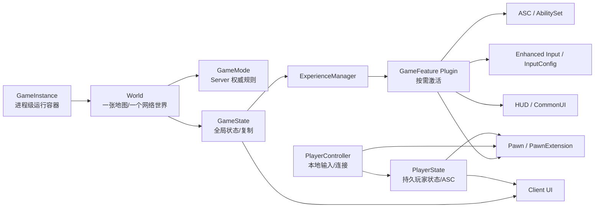

# Lyra 四条运行时链路研究记录

> 研究范围：Extraction Ops 当前仓库、UE 5.8/Lyra 代码与已验证的 Editor `-server` 多人基线。
> 本文关注“谁创建、谁拥有、谁复制、谁消费”，不把对象之间的方便调用误写成继承关系。

## 结论先行

四条链不是四条独立流水线，而是以 `World/GameState` 为汇合点：



最重要的边界是：

| 对象 | 主要职责 | 典型存在端 | 是否适合存放权威状态 |
| --- | --- | --- | --- |
| `GameInstance` | 跨 World 的进程级服务、Subsystem、登录/会话初始化 | Client、Server 各自一份 | 适合进程级服务，不适合战局状态 |
| `World` | 当前地图、NetMode、Actor 生命周期 | 每个运行实例 | 不是状态容器本身 |
| `GameMode` | 规则、生成、登录、Experience 选择 | Server；Client 不拥有有效 GameMode | 是，但只在 Server |
| `GameState` | 战局公共状态、Experience 管理、复制给客户端 | Server 创建，Client 接收 | 是，适合全局可观察状态 |
| `PlayerController` | 连接、本地输入、Possess、客户端请求入口 | Server 有服务器端对象；Owning Client 有本地对象 | 不适合存持久玩家状态 |
| `PlayerState` | 玩家身份、队伍、PawnData、ASC、属性 | Server 创建并复制到各 Client | 是，适合跨 Pawn 持久状态 |
| `Pawn` | 当前可控制的物理化身、移动、摄像机、输入承载 | Server 与相关 Client | 只存当前 Pawn 生命周期状态 |
| `HUD/UI` | 读取状态、表现和交互 | Client/本地玩家 | 不应成为权威来源 |

## 一、Experience → GameFeature → Pawn / Ability / Input / HUD

### 1. Experience 是一组“本局装配声明”

`ULyraExperienceDefinition` 是 `UPrimaryDataAsset`，核心字段只有三组：

- `GameFeaturesToEnable`：本 Experience 要激活的 GameFeature Plugin 名称；
- `DefaultPawnData`：玩家默认 Pawn 配置；
- `Actions` 和 `ActionSets`：Experience 加载、激活、停用、卸载时执行的动作。

证据：[LyraExperienceDefinition.h](../../Source/LyraGame/GameModes/LyraExperienceDefinition.h:15)。

Experience 本身不直接“实现射击”或“创建 UI”。它更像一张装配表：告诉运行时需要哪些插件、默认 Pawn 是什么、哪些 Action 应该在这个 World 中生效。

### 2. GameMode 决定当前使用哪个 Experience

地图启动后，`ALyraGameMode::InitGame()` 延迟到下一帧执行 Experience 分配。代码给出了明确的优先级：

1. Matchmaking assignment；
2. URL 参数中的 `Experience=`；
3. PIE Developer Settings override；
4. 命令行 `-Experience=`；
5. World Settings 的默认 Experience；
6. Dedicated Server 登录/Host 流程；
7. `B_LyraDefaultExperience`。

证据：[LyraGameMode.cpp](../../Source/LyraGame/GameModes/LyraGameMode.cpp:80)。地图默认值来自 `ALyraWorldSettings::DefaultGameplayExperience`，并转换成 Primary Asset ID。

这里有一个关键点：Experience 的选择是 GameMode 的 Server 侧工作。Client 不应该自己决定权威 Experience，而是等待 GameState 上复制下来的 Experience 状态。

### 3. GameState 上的 ExperienceManager 负责异步加载和复制

`ALyraGameState` 创建两个重要组件：

- `ULyraExperienceManagerComponent`：管理当前 Experience；
- `ULyraAbilitySystemComponent`：处理 GameState 范围的 Gameplay Cue/能力系统。

证据：[LyraGameState.cpp](../../Source/LyraGame/GameModes/LyraGameState.cpp:22)。

ExperienceManager 的主要流程是：

```text
SetCurrentExperience
  → CurrentExperience 设置并复制
  → StartExperienceLoad
  → 加载 Experience / ActionSet 的资产 Bundle
  → 按 Client/Server NetMode 选择 Bundle
  → 找到 GameFeature Plugin URL
  → LoadAndActivateGameFeaturePlugin
  → 执行 Experience Actions / ActionSet Actions
  → 广播 OnExperienceLoaded
```

对应代码集中在：[LyraExperienceManagerComponent.cpp](../../Source/LyraGame/GameModes/LyraExperienceManagerComponent.cpp:56)。其中：

- `CurrentExperience` 使用 `ReplicatedUsing=OnRep_CurrentExperience`；
- Editor 会同时加载 Client/Server Bundle；
- Dedicated Server 不加载纯 Client Bundle；
- Client-only 不加载纯 Server Bundle；
- `GameFeaturesToEnable` 和 ActionSet 中的同名字段都会被收集；
- 所有 Plugin 加载完成后，才执行 GameFeature Actions 并广播加载完成委托。

因此，“Experience 已经被选中”和“Experience 已经可玩”不是同一个时刻。依赖 Experience 的系统应该注册 `CallOrRegister_OnExperienceLoaded(...)`，而不是假设地图刚打开就可以读取所有资产。

### 4. GameFeature Action 把声明落到运行对象

#### 4.1 Ability：Server 侧给 ASC 添加能力

`UGameFeatureAction_AddAbilities` 在激活时通过 `UGameFrameworkComponentManager` 注册 Actor Extension Handler，等待目标 Actor 的扩展事件。收到 `NAME_LyraAbilityReady` 或扩展添加事件后，Server 才真正执行：

- 创建或查找 AbilitySystemComponent；
- `GiveAbility` 添加单个 Ability；
- 添加 AttributeSet；
- 通过 `ULyraAbilitySet::GiveToAbilitySystem` 添加 AbilitySet；
- 在停用时反向移除能力、属性和 AbilitySet Handle。

证据：[GameFeatureAction_AddAbilities.cpp](../../Source/LyraGame/GameFeatures/GameFeatureAction_AddAbilities.cpp:104)。`AddActorAbilities()` 明确检查 `Actor->HasAuthority()`，所以客户端不能靠激活 Feature 自己授予权威能力。

#### 4.2 Input：两层注入，不要混为一谈

Lyra 有两类输入注入：

1. `GameFeatureAction_AddInputContextMapping`：把 `UInputMappingContext` 添加到本地玩家的 `UEnhancedInputLocalPlayerSubsystem`；它作用于 LocalPlayer。
2. `GameFeatureAction_AddInputBinding`：在 Pawn 扩展事件发生时，将额外 `ULyraInputConfig` 交给 `ULyraHeroComponent::AddAdditionalInputConfig()`，把 InputTag 绑定到 HeroComponent 的 Native/Ability 输入回调。

证据：[GameFeatureAction_AddInputContextMapping.cpp](../../Source/LyraGame/GameFeatures/GameFeatureAction_AddInputContextMapping.cpp:192) 和 [GameFeatureAction_AddInputBinding.cpp](../../Source/LyraGame/GameFeatures/GameFeatureAction_AddInputBinding.cpp:104)。

HeroComponent 的基础输入流程是：

```text
PawnData
  → InputConfig
  → Enhanced Input Mapping Context
  → InputTag → InputAction
  → HeroComponent 回调
  → ASC AbilityInputTagPressed/Released
```

证据：[LyraHeroComponent.cpp](../../Source/LyraGame/Character/LyraHeroComponent.cpp:225)。它只在本地玩家拥有有效 Controller、LocalPlayer、InputComponent，并且 PawnExtension 已完成数据初始化后绑定输入。

#### 4.3 HUD：通过 HUD 接收者和 UI Extension 注入

`ALyraHUD` 不是让每个玩法类手动 `CreateWidget` 的地方。它在 `PreInitializeComponents()` 注册为 GameFramework Component Receiver，在 `BeginPlay()` 发出 `NAME_GameActorReady`。

`GameFeatureAction_AddWidgets` 监听 HUD 扩展事件，然后：

- 取得 HUD 的 Owning PlayerController；
- 转成 LocalPlayer；
- 用 CommonUI 把 Layout Push 到指定 Layer；
- 用 `UUIExtensionSubsystem` 把 Widget 注册到指定 Slot；
- 停用 Feature 时注销 Layout 和 Extension Handle。

证据：[LyraHUD.cpp](../../Source/LyraGame/UI/LyraHUD.cpp:25)、[LyraHUD.h](../../Source/LyraGame/UI/LyraHUD.h:16)、[GameFeatureAction_AddWidget.cpp](../../Source/LyraGame/GameFeatures/GameFeatureAction_AddWidget.cpp:91)。Lyra 自己也明确建议通过 Experience 的 Add Widget Action 扩展 HUD，而不是修改 `ALyraHUD` 本身。

### 5. PawnData 是 Experience 与 Pawn/ASC/Input 的桥

Experience 的 `DefaultPawnData` 最终通过 `ALyraGameMode::GetPawnDataForController()` 提供给玩家。玩家加入后，`ALyraPlayerState::OnExperienceLoaded()` 调用 GameMode 获取 PawnData，并在 Server 侧 `SetPawnData()`：

- 设置可复制的 `PawnData`；
- 将 PawnData 中的 AbilitySets 授予 PlayerState 的 ASC；
- 发出 `NAME_LyraAbilityReady` 扩展事件；
- 强制网络更新。

证据：[LyraPlayerState.cpp](../../Source/LyraGame/Player/LyraPlayerState.cpp:109) 和 [LyraPlayerState.cpp](../../Source/LyraGame/Player/LyraPlayerState.cpp:185)。

之后，当前 Pawn 上的 `ULyraPawnExtensionComponent` 和 `ULyraHeroComponent` 用初始化状态链协调时序：

```text
Spawned
  → DataAvailable
  → DataInitialized
  → GameplayReady
```

PawnExtension 负责 PawnData、ASC Avatar 初始化和生命周期清理；HeroComponent 等待 PawnExtension、PlayerState、Controller 和本地输入条件满足后，初始化输入并把 PlayerState 的 ASC 绑定成当前 Pawn 的 Avatar。

证据：[LyraPawnExtensionComponent.cpp](../../Source/LyraGame/Character/LyraPawnExtensionComponent.cpp:76) 和 [LyraHeroComponent.cpp](../../Source/LyraGame/Character/LyraHeroComponent.cpp:76)。

### 6. 第一条链的端侧矩阵

| 事项 | Server | Owning Client | Other Client | Dedicated Server |
| --- | --- | --- | --- | --- |
| 选择权威 Experience | 是 | 否 | 否 | 是 |
| 激活 GameFeature | 是 | 按复制状态加载 | 按复制状态加载 | 是 |
| 授予权威 Ability/Attribute | 是 | 否 | 否 | 是 |
| 添加本地 Input Mapping | 否/无 LocalPlayer | 是 | 是，各自本地 | 否 |
| 创建 HUD Widget | 否 | 是 | 是，各自本地 | 否 |
| 当前 Pawn 的本地输入 | 是服务器模拟/规则侧 | 是 | 否 | 否 |

## 二、GameInstance → World → GameMode → GameState

这条链描述的是“进程容器 → 当前网络世界 → Server 规则 → 可复制战局状态”。它不是简单的父子对象链。

### 1. GameInstance：跨 World、非复制

`ULyraGameInstance` 继承 `UCommonGameInstance`。它的 `Init()` 会：

- 注册 Lyra 的 Pawn 初始化状态：Spawned、DataAvailable、DataInitialized、GameplayReady；
- 初始化本地调试加密 key；
- 绑定 CommonSession 的客户端旅行回调。

`Shutdown()` 解除会话回调。

证据：[LyraGameInstance.cpp](../../Source/LyraGame/System/LyraGameInstance.cpp:88)。

GameInstance 适合放：Subsystem、会话、登录、跨地图客户端设置、连接级服务。它不应保存某一局的玩家生命、弹药或战利品，因为一次进程可以经历多个 World/Map，而且它不通过网络复制。

### 2. World：把所有运行对象放进当前地图上下文

World 提供：

- 当前 Map 和 World Settings；
- NetMode；
- GameMode / GameState；
- Actor、Subsystem、Timer、Travel 生命周期。

同一个进程可以有多个 World（例如 PIE 多实例），因此通过 `GetWorld()` 获取上下文比使用全局单例更安全。GameFeature Action 也以 `FWorldContext` 和 `OwningGameInstance` 为入口，避免把一个 Feature 的状态错误地作用到另一个 World。

### 3. GameMode：只在 Server 决定规则

`ALyraGameMode` 构造函数指定本项目的核心类：

```text
GameStateClass        = ALyraGameState
PlayerControllerClass = ALyraPlayerController
PlayerStateClass      = ALyraPlayerState
DefaultPawnClass      = ALyraCharacter
HUDClass              = ALyraHUD
```

证据：[LyraGameMode.cpp](../../Source/LyraGame/GameModes/LyraGameMode.cpp:33)。

GameMode 负责：Experience 选择、PawnData 选择、玩家加入、出生点、重生和规则决策。它不应该被客户端 UI 当作数据源；Client 侧应该读 GameState、PlayerState 或自己的 Controller。

### 4. GameState：把战局公共事实带到 Client

`ALyraGameState` 是 `AModularGameStateBase`，拥有 ExperienceManager 和全局 ASC。它的 `ServerFPS` 用复制属性传到客户端；它还提供可靠/不可靠的 Multicast 消息入口，并通过 `UGameplayMessageSubsystem` 在 Client 转发消息。

证据：[LyraGameState.h](../../Source/LyraGame/GameModes/LyraGameState.h:26) 和 [LyraGameState.cpp](../../Source/LyraGame/GameModes/LyraGameState.cpp:85)。

可以把 GameMode/GameState 的关系记成：

```text
Server GameMode 读取/决定规则
        ↓
Server GameState 保存需要公开的战局状态
        ↓ replication / multicast
Client GameState 驱动显示和本地反应
```

## 三、PlayerController → PlayerState → Pawn

这个箭头需要修正为“控制关系 + 状态关系”，而不是说 PlayerState 是 Pawn 的父对象。

### 1. PlayerController 是连接和本地输入边界

`ALyraPlayerController` 提供：

- 读取 Lyra PlayerState；
- 读取 PlayerState 上的 ASC；
- 读取 HUD；
- `OnPossess` / `OnUnPossess`；
- `InitPlayerState`、`OnRep_PlayerState`；
- 本地输入预处理和玩家设置。

证据：[LyraPlayerController.h](../../Source/LyraGame/Player/LyraPlayerController.h:32)。它也把当前拥有的 Pawn 当作输入目标，但输入不是“直接改权威状态”，而是通过 Ability/RPC/复制规则完成最终结果。

### 2. PlayerState 是跨 Pawn 的玩家身份和能力容器

玩家死亡、重生或换 Pawn 时，Pawn 可以变化，但 PlayerState 通常代表同一个玩家继续存在。Lyra 把以下内容放在 PlayerState：

- `PawnData`；
- `ULyraAbilitySystemComponent`；
- Health/Combat AttributeSet；
- Team/Squad；
- Connection Type；
- 复制的视角和统计标签。

证据：[LyraPlayerState.cpp](../../Source/LyraGame/Player/LyraPlayerState.cpp:30)。

因此，Lyra 的 ASC 关系是：

```text
PlayerState = ASC OwnerActor / 持久状态
Pawn        = ASC AvatarActor / 当前实体
```

`PostInitializeComponents()` 先把 ASC 的 ActorInfo 初始化到 PlayerState 和当前 Pawn；HeroComponent 在 Pawn 初始化阶段再次确保 ASC 的 Owner/Avatar 关系正确，尤其要处理换 Pawn 和死亡后的清理。

### 3. Pawn 是可替换的当前实体

Pawn 负责当前这一具角色的移动、碰撞、摄像机、当前装备表现和本地输入承载。`ULyraPawnExtensionComponent` 的 `InitializeAbilitySystem()` 会把 PlayerState 的 ASC 设为当前 Pawn 的 Avatar，并在 Pawn 结束时取消能力、清理 Gameplay Cue、清空 ActorInfo。

这解释了为什么不能把跨死亡持久的背包、玩家身份或最终结算只放在 Pawn 上：Pawn 可能被销毁，PlayerState 才是更稳定的玩家状态边界。

### 4. 真正的关系图

```text
PlayerController ── owns/controls ──> Pawn
       │                              │
       │                              └─ current AvatarActor
       │
       └─ owns/associates ──> PlayerState
                                  ├─ persistent player state
                                  ├─ ASC OwnerActor
                                  └─ PawnData / AbilitySets
```

PlayerState 不是 Pawn 的替代品，Pawn 也不是 PlayerState 的显示副本；两者通过 Controller、PawnExtension 和 ASC ActorInfo 协作。

## 四、PlayerState / GameState → UI

这条链描述“权威状态如何成为客户端表现”，而不是 UI 直接访问服务器对象。

### 1. State 到 UI 的两种主要通道

#### 持续状态：Replication → Client 读取

适合：

- Health、Armor、Ammo；
- Team、Squad、PlayerName；
- 当前 Experience；
- Server FPS；
- Inventory Version 或其他可恢复状态。

Server 修改 GameState/PlayerState 的复制属性，Client 收到后通过 `OnRep`、绑定通知或低频刷新更新 UI。UI 应该能够在重新打开、重连或错过某条事件后，根据当前状态恢复显示。

#### 瞬时事件：Message/RPC/Multicast → Client 表现

适合：

- 击杀提示；
- 飘字；
- 系统通知；
- 一次性音效/提示。

`ALyraGameState::MulticastMessageToClients()` 在 Client 侧通过 `UGameplayMessageSubsystem` 广播；`ALyraPlayerState::ClientBroadcastMessage()` 也只在 `NM_Client` 执行消息广播。

这类事件可能丢失时，必须保证丢失后不会破坏权威状态；需要可恢复的内容仍应落到复制状态。

### 2. HUD 是 UI 的挂载点，不是状态来源

`ALyraHUD` 主要负责成为 GameFramework Component Receiver 和调试 Actor 列表提供者。实际的 HUD Layout/Widget 由 Experience 的 `GameFeatureAction_AddWidgets` 注入 CommonUI Layer/Slot。

所以 Week 02 的调试 HUD 应该：

- 通过 GameFeature Action 注入；
- 在 Client/LocalPlayer 上创建；
- 从本地 World 的 GameState、PlayerState、Controller 读取信息；
- 不把数值写回 GameState/PlayerState；
- 不在 Dedicated Server 创建 Widget。

### 3. UI 读取边界

| UI 要显示的内容 | 推荐来源 | 不推荐来源 |
| --- | --- | --- |
| 当前玩家 Health/Armor | 本地 PlayerState/ASC 的复制结果 | Client 自己猜测的伤害结果 |
| 全局比赛阶段 | GameState / Gameplay Message | GameMode |
| 玩家队伍 | PlayerState | Pawn 上的临时变量 |
| 当前网络角色 | Pawn/Controller 的本地 NetRole | 服务器发来的字符串 |
| 当前 Experience | GameState 的 ExperienceManager | UI 自己加载资产 |
| HUD Widget 布局 | Experience/GameFeature Action | GameMode 里硬编码 `CreateWidget` |

## 五、四条链串起来的完整时序

```text
进程启动
  → GameInstance::Init 注册初始化状态和跨 World 服务
  → World 创建，读取地图/WorldSettings
  → Server GameMode::InitGame 选择 Experience
  → GameState 的 ExperienceManager 设置 CurrentExperience
  → Client/Server 按 Bundle 加载资源
  → GameFeaturesSubsystem LoadAndActivate Plugin
  → Experience Actions 执行
       ├─ Ability Action 注册 Actor Extension Handler
       ├─ Input Action 注册 Controller/Pawn 注入逻辑
       └─ Widget Action 注册 HUD Receiver
  → PlayerController / PlayerState / Pawn 创建
  → Server PlayerState 收到 ExperienceLoaded
  → PlayerState 设置 PawnData，授予基础 AbilitySets
  → PawnExtension 进入 Spawned/DataAvailable/DataInitialized
  → HeroComponent 绑定 ASC Avatar 和本地输入
  → HUD GameActorReady，注入 CommonUI
  → GameState / PlayerState 复制到各 Client
  → UI 读取复制状态并显示
```

其中最容易出错的时序假设是：

- `World BeginPlay` 不等于 Experience 已完成加载；
- `PlayerController` 存在不等于 PlayerState 已经完成复制；
- Pawn 存在不等于 PawnData、ASC 和 Input 已经准备好；
- Widget 出现不等于它拥有权威状态；
- Server 发送了事件不等于 Client 永远能收到事件。

## 六、对 ExtractionOps 的设计约束

基于上面的调用链，Week 02/后续实现应遵守：

1. ExtractionOps 的玩法装配放进自己的 GameFeature Plugin 和 Experience，不直接修改 Lyra 核心 GameMode。
2. 物品、玩家身份、跨 Pawn 状态放 PlayerState 或独立权威服务；当前 Pawn 只持有实体化状态。
3. Server 负责选择 Experience、授予能力、修改最终状态；Client 只提交输入意图并显示复制结果。
4. Input 通过 InputTag/Enhanced Input/Feature Action 接入，不在 Pawn 蓝图里散落硬编码按键。
5. HUD 通过 Add Widget Action 和 CommonUI Extension 注入；停用 Feature 必须撤销 Widget、Input Mapping 和 Ability Handle。
6. 可恢复信息使用复制状态；一次性表现使用 Gameplay Message/RPC，但不让消息成为唯一事实来源。
7. 任何依赖 Experience、PawnData、PlayerState 或 ASC 的代码都要处理“对象已创建但数据尚未就绪”的阶段。
8. Dedicated Server 不创建 Client UI，不依赖 `LocalPlayer`，也不把 `GameMode` 当作客户端可读数据。

## 七、验证方法与验收证据

### 静态验证

```powershell
rg -n "ULyraExperienceDefinition|SetCurrentExperience|OnExperienceLoaded" Source Plugins
rg -n "GameFeatureAction_AddAbilities|GameFeatureAction_AddInput|GameFeatureAction_AddWidget" Source Plugins
rg -n "InitAbilityActorInfo|InitializeAbilitySystem|AbilityInputTagPressed" Source Plugins
rg -n "GetAuthGameMode|GetGameState|GetPlayerState|GetHUD" Source Plugins
```

### 运行时日志

Server/Client 日志至少检查：

```text
LogLyraExperience: StartExperienceLoad
LogLyraExperience: OnExperienceLoadComplete
LogNet: IpNetDriver listening on port 7777
LogNet: Join succeeded
```

### Week 02 HUD 验收矩阵

| 场景 | 预期 |
| --- | --- |
| 单机 PIE | `Standalone`，本地 Controller、PlayerState、Pawn 均有效 |
| Listen/本地 Server | Server 侧显示 Authority；本地 Client 显示 AutonomousProxy |
| 两 Client | 每个 Client 对自己的 Pawn 显示 AutonomousProxy，对方显示 SimulatedProxy |
| Dedicated Server | Experience/规则加载，但不创建 HUD Widget/LocalPlayer |
| 停用 ExtractionOps Feature | 调试 HUD 消失；默认 Lyra Experience 仍可运行 |
| Pawn 重生 | PlayerState/ASC 持续，Pawn Avatar 重新绑定 |

## 参考源码索引

- Experience 定义：[LyraExperienceDefinition.h](../../Source/LyraGame/GameModes/LyraExperienceDefinition.h)
- Experience 加载：[LyraExperienceManagerComponent.cpp](../../Source/LyraGame/GameModes/LyraExperienceManagerComponent.cpp)
- Experience 选择：[LyraGameMode.cpp](../../Source/LyraGame/GameModes/LyraGameMode.cpp)
- GameInstance 初始化：[LyraGameInstance.cpp](../../Source/LyraGame/System/LyraGameInstance.cpp)
- GameState：[LyraGameState.h](../../Source/LyraGame/GameModes/LyraGameState.h)、[LyraGameState.cpp](../../Source/LyraGame/GameModes/LyraGameState.cpp)
- PlayerController：[LyraPlayerController.h](../../Source/LyraGame/Player/LyraPlayerController.h)、[LyraPlayerController.cpp](../../Source/LyraGame/Player/LyraPlayerController.cpp)
- PlayerState/ASC：[LyraPlayerState.cpp](../../Source/LyraGame/Player/LyraPlayerState.cpp)
- Pawn 初始化：[LyraPawnExtensionComponent.cpp](../../Source/LyraGame/Character/LyraPawnExtensionComponent.cpp)
- 输入与 Ability：[LyraHeroComponent.cpp](../../Source/LyraGame/Character/LyraHeroComponent.cpp)
- Ability Feature Action：[GameFeatureAction_AddAbilities.cpp](../../Source/LyraGame/GameFeatures/GameFeatureAction_AddAbilities.cpp)
- Input Feature Actions：[GameFeatureAction_AddInputBinding.cpp](../../Source/LyraGame/GameFeatures/GameFeatureAction_AddInputBinding.cpp)、[GameFeatureAction_AddInputContextMapping.cpp](../../Source/LyraGame/GameFeatures/GameFeatureAction_AddInputContextMapping.cpp)
- HUD Feature Action：[GameFeatureAction_AddWidget.cpp](../../Source/LyraGame/GameFeatures/GameFeatureAction_AddWidget.cpp)
- HUD 接收者：[LyraHUD.h](../../Source/LyraGame/UI/LyraHUD.h)、[LyraHUD.cpp](../../Source/LyraGame/UI/LyraHUD.cpp)
